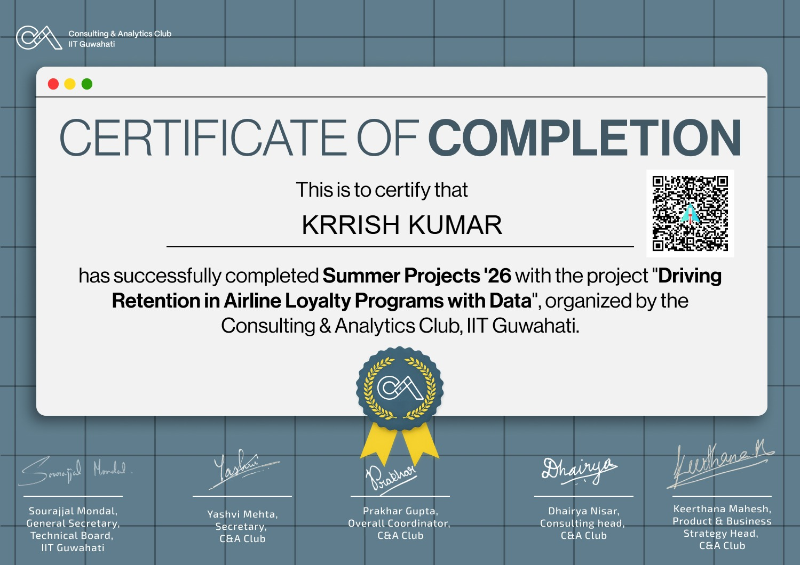

# Unlocking Behavioral Intelligence in Airline Loyalty Programs ✈️



*Certified by IIT Guwahati Summer Analytics*

## 📌 Project Summary & Business Constraint
This project features an end-to-end Machine Learning pipeline and an Executive Digital Twin dashboard designed to operationalize airline loyalty retention. Frequent flyer programs are high-margin assets, but customer churn within premium tiers results in massive lifetime value (LTV) destruction. The objective was to build a proactive early-warning engine to predict latent disengagement before customers permanently switch to competing carriers.

## ⚙️ The Technical Architecture
* **Data Engineering:** Engineered a "Silent Churn" definition and implemented a strict Temporal Firewall to prevent data leakage during model training.
* **Unsupervised Learning:** Deployed K-Means clustering to identify hidden behavioral segments within the loyalty base.
* **Predictive Algorithm:** Built an XGBoost early-warning engine capable of classifying at-risk loyalty members with high precision.
* **Deployment:** Engineered a Streamlit application acting as the Executive Operations Command Center for real-time churn monitoring.

## 💻 Execution Instructions (Local Environment)
This pipeline is explicitly packaged for seamless local execution.

**PHASE A: THE ML PIPELINE**
1. Open `Airline_Loyalty_Intelligence.ipynb` using Jupyter, VS Code, or your preferred IDE.
2. Execute the cells sequentially. 
3. Upon successful execution, the pipeline will process the raw data, train the models, and automatically generate a new intelligence matrix (`scored_members.csv`).

**PHASE B: THE RETENTION DASHBOARD**
1. Open your Command Prompt or Terminal and navigate to this repository folder.
2. Install the required dependencies:
```bash
   pip install streamlit pandas numpy scikit-learn xgboost
```
3. Launch the application dashboard:
   ```bash
   python -m streamlit run loyalty_dashboard.py
   ```
